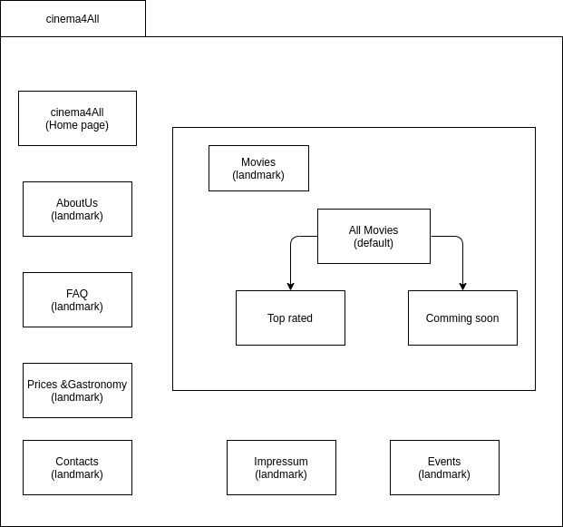

# cinema4All
## Devision of Work
 **Developer:** Schütze (schuefab), Kulke (kulkeeli)
- **Design of Protype:** Kulke & Schütze
- **Creation of Prototype:** Schütze
- **Creation of Logo:** Kulke
- **Header and Navigation:** Kulke
- **Footer**: Schütze
- **General Structure**: Kulke
- **Main Content of Home Page**: Schütze
- **Main Content of Prices&Gastronomy**: Schütze
- **XML File**: Kulke
- **JavaScript**: Kulke
- **Main Content of Events**: Schütze
- **Event Page**: Schütze
- **Prices & Gastronomy Page**: Schütze
- **Movie Page**: Kulke
- **Top Rated Page**: Kulke
- **Comming Soon Page**: Kulke
- **FAQ Page**: Schütze
- **Contacts Page**: Schütze
- **Legal Notice Page**: Schütze
- **About Us Page**: Schütze

## Requirements
**Business Description**  
Our company is called "'cinema4all". We offer all kinds of films suitable for all ages. 
Our aim is to make the user happy to find all new, upcoming and famous films.
The user can get information about  our offers ,events ,specialities and the gastronomy.

We are a team of movie fans trying to provide a great cinema experience for people of all ages.
We achieve that by providing a wide variety of great movies, tasty food and three gorgeous cinema halls.
In July of 2003 we opened our cinema with just one small cinema hall. 
Since then we always tried to improve to give our customers the best movie experience possible.

**E-Mail**: contact@cinema4all.de  
**tel.**:+0123456789  
**Fax**: 1234-56789  
**Website title**: cinema4all  
**Domain**: cinema4all.de  
**Information to our Prices & Gastronomy**  
Tickets: 10€  
Children and Students:  9€  
Popcorn: small: 3€ medium: 4€ large: 5€  
Nachos with cheese: 5€  
Drinks: small: 2€ medium: 3€ large: 3,50€  

**Event**: Surprise Movie  
**Description**: See a surprise movie selected by us.  

**Resources**  
  
**Gastronomy**  
    
    
    

**Movies**

**Joker**:  
(Top rated)    
  
Plot: https://www.imdb.com/title/tt7286456/?ref_=nv_sr_srsg_0  
Trailer: https://youtu.be/zAGVQLHvwOY  
**Titanic**:  
(Top rated)  
  
Plot: https://www.imdb.com/title/tt0120338/?ref_=fn_al_tt_1  
Trailer: https://youtu.be/kVrqfYjkTdQ  
**Us**:  
  
Plot : https://www.imdb.com/title/tt6857112/plotsummary  
Trailer : https://youtu.be/kP3QLKZb2HM  
**Avengers Endgame**:  
  
Plot: https://www.imdb.com/title/tt4154796/?ref_=nv_sr_srsg_0  
Trailer: https://www.youtube.com/watch?v=TcMBFSGVi1c  

**Star Wars: The Rise of Skywalker**:  
  
Trailer: https://www.youtube.com/watch?v=8Qn_spdM5Zg  
**JamesBond: (Comming soon)**:  
  
Trailer: https://youtu.be/yHafN0M2kl0  
**Wunder**:  
  
Trailer: https://youtu.be/Ob7fPOzbmzE  
**Fast & Furious: Hobbs & Shaw**:  
  
Trailer:  https://youtu.be/HZ7PAyCDwEg  
**Tenet**:  
  
Trailer:  https://youtu.be/L3pk_TBkihU  

**list of the webpages**  
**Home**: home.html (landmark)  
Main page should contain all pages    
Title: Main Page  
**Contact**:  contact.html (landmark)   
Email and social media   
Title: Contact Us  
**About**  : about.html (landmark)  
This page includes a short description of the company    
Title : About Us   
**Movies** : movies.html (landmark)   
list of movies with basic information .   
Title: Movies  
**Events** : events.html   
all events with short descriptions (movie , playtime ,...)   
Title: events  
**Prices & Gastronomy**: prices.html   
Popcorn,nachos ,Drinks .(photos)   
Title: Prices & Gastronomy   
**Impressum | AGBs**: Impressum.html (landmark)   
These pages will include all the need legal information   
Title:  Impressum   
**Comming soon**: CommingSoon.html  
The Movies wich will be released. It icludes all information about the movie. e.g. actors, posters, trailer videos, plot... etc.   
Title: Coming soon   
**Top rated movies** : topRated.html  
It icludes all information about the movie. e.g. actors, posters, trailer videos, plot... etc.
Title:Top rated  
**FAQ***: faq.html (landmark)  
Here will be displayed several questions which can be asked from users or which we expect to be asked.  
Title: FAQ  

**Requirements**    
**XML Data file**:  
List of all movies with their year of release,  
**SVG**: Logo  
**Audio/Video**: Trailers  for each movie are to be added on the website.     
**Colour Scheme**: Base: 602C99, Accent:E3D733  
**Font**: Arial  
**Layout**:  
  
**Website Design Diagram** :  
  

